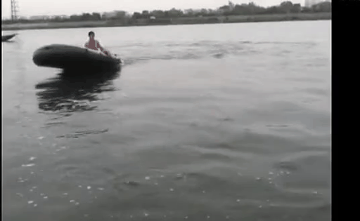

# 🎬 Demo (Code + Assets)

This repository contains:
- **Demo assets**: `assets/demo.gif`, `assets/demo_seg.gif`
- **Reproducible demo script**: generates `demo.gif`, `demo_seg.gif`, and a `README_DEMO.md` snippet

---

## Quick Preview

**Instruction / Question:** the ship that is the farthest from the camera.

| **Original Video** | **Segmentation Overlay** |
| --- | --- |
|  |  |

---

## Run the demo script (with your own HF model + video)

### Setup

```bash
python -m venv .venv
source .venv/bin/activate
pip install -r requirements.txt
```

### Run

```bash
bash scripts/run_demo.sh /path/to/hf_model /path/to/video.mp4 "Please segment the target object." ./outputs/demo1
```

Outputs are saved under `./outputs/demo1/`.

## Notes
- Model weights are **NOT** included.
- The overlay GIF renders a **single automatically selected mask** (picked to be the most "single-object" among all predicted masks).
